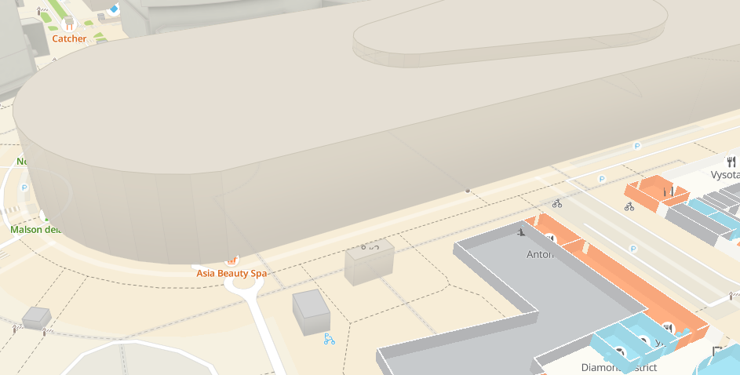

Наша карта уже достаточно давно рендерится при помощи технологий трехмерной графики. Сначала мы использовали эти технологии просто как очень быструю рисовалку двухмерных данных с небольшими исключениями в виде 3D-домов и моделей.

Приход в карту иммерсивных возможностей начал менять сложившееся положение вещей  --- моделей стало больше, они стали красивее и детальнее, появилось больше желания призумиться и рассматривать их. Наши картографические движки, заточенные на работу на масштабе города/отдельного района теперь должны научиться отображать ближние вьюпорты с более высокой детализацией. И тут возникла проблема:

Наши POI (иконки и надписи организаций и значимых мест) по-прежнему ощущают себя на двухмерной карте, игнорируя трехмерные геометрии. Это дизориентирует и создает визуальный мусор, ведь глядя на башни Сити меньше всего хочешь видеть иконки находящиеся  за 300-700 метров позади. Нужно было научить наши POI корректно рисоваться вместе с 3D объектами, скрываясь за ними при необходимости.

И мы начали экспериментировать.
## Решение при помощи буфера глубины

WebGL, как и все другие трехмерные API, предоставляет стандартную возможность для скрытия одних 3D объектов другими - [буфер глубины](https://ru.wikipedia.org/wiki/Z-буферизация). Если просто взять POI и включить им глубину, картинка будет следующая:

Да, иконки начинают скрываться зданиями, однако вовсе не таким способом, каким ожидаешь - видно, что иногда здание отъедает кусок POI или часть надписи, делая ее нечитабельной.

Проблема в том, что POI не совсем "честный" 3D объект. Она сохраняет свою позицию на трехмерной сцене, но в то же время не подчиняется перспективе  - не уменьшается при удалении от камеры, не поворачивается вместе со сценой, оставаясь всегда лицом к пользователю. Это очевидное с точки зрение UX решение делает ее маргиналом в трехмерном пространстве. Использование буфера глубины напрямую нам не подходит.

Поэтому мы стали продумывать альтернативные способы решения.
## Аналитический подход

Аналитический подход предполагает расчет скрытия на CPU при помощи алгоритмов [бросания луча](https://ru.wikipedia.org/wiki/Ray_casting).

![[ray_casting.png]]

Из камеры по направлению к каждой POI кидается луч, для которого проверяется пересечение с каждым 3D объектом.

У нас на карте запросто может быть несколько тысяч POI и несколько тысяч 3D объектов на экране, что в итоге дает миллионы итераций. А проверку пересечения нужно проводить на каждый кадр, то есть максимум за 10-15мс. Не проходит по производительности.
## Отдельная сцена скрытия POI

В этом подходе мы сгружаем вычисления на GPU. Для этого во вспомогательном [фреймбуфере](https://ru.wikipedia.org/wiki/Кадровый_буфер)  отрисовываем POI вместе с 3D объектами с использованием буфера глубины и пользуемся данными из этого фреймбуфера в шейдерах, при  отрисовке основной сцены. Условно говоря, если под центром POI в фреймбуфере красный цвет, то считаем его видимым, если красного цвета нет, то скрытым. 

Вот так примерно это выглядит - тут фреймбуфер скрытия POI полупрозрачно наложен на основную сцену.

Отрисовка отдельного фреймбуфера влечет за собой накладные расходы по производительности, впрочем не столь большие как при аналитическом подходе. К тому же их можно уменьшить, снизив разрешение этого фреймбуфера. На картинке этот фреймбуфер имеет в 2 раза меньшее разрешение, это видно в виде большой пикселизованности красных областей.

В результате мы практически достигли нужно результата, но остался один момент:

Теперь POI начали скрываться целиком и не обрезаться прилегающими зданиями, однако они стали неприятно мерцать.

Причина этого кроется в том, что при пересечении POI и 3D-объекта возникают пиксельные решетки, при проходе по которым центра POI (по которому мы судим о видимости) слишком часто меняются состояния

Преимущество данного подхода - скорость работы обернулась для нас недостатком. 

Борьба с пиксельной решеткой впоследствии оказалась достаточно нетривиальным делом. Мы перепробовали множество вариантов, начиная от различных способов антиалиасинга, блюра, до варианта с двумя фреймбуферами и моушен-блюром.

На экране иконки в сцене скрытия при движении оставляли за собой красивые хвосты, но успеха эти попытки нам не принесли.
## Асинхронная сцена скрытия

Другой наш подход заключался в том, чтобы мы расчитывали вспомогательный фреймбуфер не каждый кадр, а гораздо реже - где-то раз в 100-150мс и использовать его результаты в JS.

Для этого нам нужно отрисовать вспомогательный фреймбуфер и скачать его обратно из GPU в память CPU. После этого можно заглядывать в пикселы так же как и в шейдерах, благо спроецировать центр POI в координаты экрана является делом достаточно несложным.

Данный подход был нами реализован и нам удалось победить мерцание POI. Однако редкая отрисовка и последующее скачивание вспомогательного буфера приводили к отложенным изменениям в расположении POI на экране -- они долго изменяли свою конфигурацию после отзума или поворота карты.

## Продакт-ревью

Становилось понятно, что времени на фичу ушло уже достаточно, полноценного решения  нет, зато есть множество неидеальных. Собрав их в кучу мы пошли к нашим продактам. Как и нас, ни один из вариантов их полностью не устроил.

Зато они отсекли вариант с асинхронной сценой, что позволило сосредоточиться нам на решении со скрытием в шейдерах. Еще продакты подсказали нам, что больше всего мерцания наблюдается у POI которые принадлежат какому-либо зданию, кроме того удобно было бы не скрывать POI собственным зданием. 

## Вторая  итерация

## Итого 

Не хотелось бы использовать избитые формулировки, но к данной фиче как нельзя лучше подходит "Было трудно, но мы справились". 

Фича получилась и она на бою. 

Было необычно в том плане, что типично трехмерную проблему не получилось все порешать внутри нашей команды, это была настоящая кросскомандная работа.

Мерцание POI до конца мы победить не смогли и оно все равно изредка происходит в особо сложных геометрических ситуациях. Будем надеяться, что в будущем мы найдем силы полностью искоренить эту проблему. 

Зато теперь стало значительно проще понять, где именно находится POI, и можно рассматривать наши красивые 3D-модели без помех. А красота спасет мир.